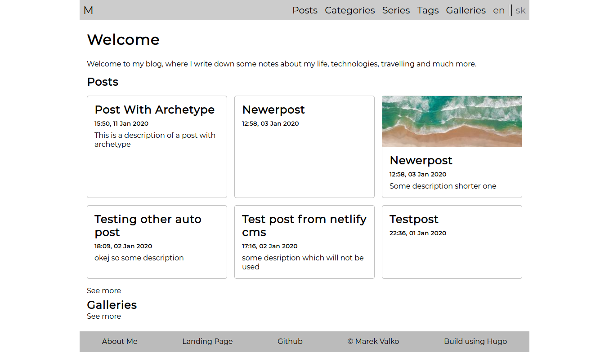

This is my custom build blog website. It doesn't have any normal content yet, because I am still working on its desing. It was created when I was learning Hugo static site generator and Netlify CMS (which it doesn't use anymore). It's build with plain html, css, javascript and using some of the Hugo magic to put everything together.

One of other features of my blog is, that it's multilingual. Also posts can be multilingual and they link to each other.

Content is then separated to categories and tags, and there is also possibility to make a series of posts.

