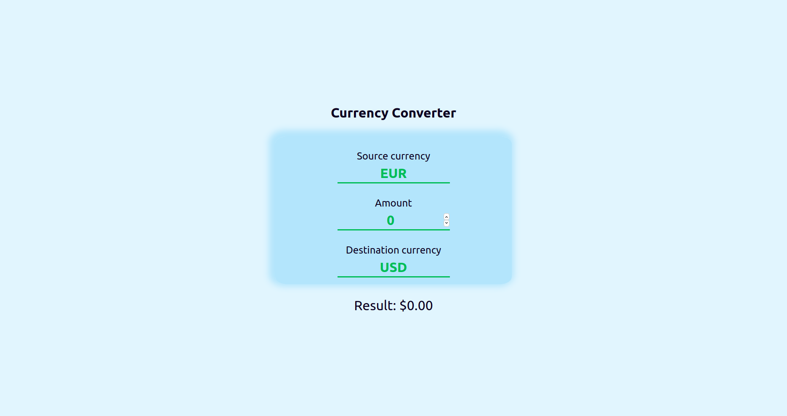

This is a currency converter app build using react. It's using functional components and react hooks (useState, useEffect) from react. It gets data from [exchangeratesapi.io](https://exchangeratesapi.io/) when the app loads and when the source currency changes. While getting data, it shows some basic loading screen (with some delay so you can see it). It also shows when user input is wrong with red color (it's green when everything is ok) and automatically updates converted amount.

