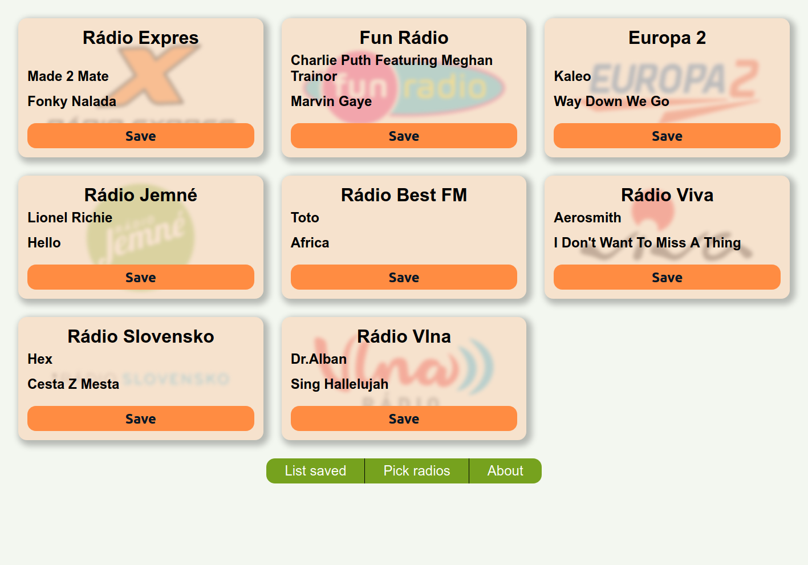

This webapp lists currently played songs in slovak radios. It let's user pick, which radios to show and allows him to save songs for later use. Source of data and radio logos is from site [radia.sk](https://www.radia.sk).

