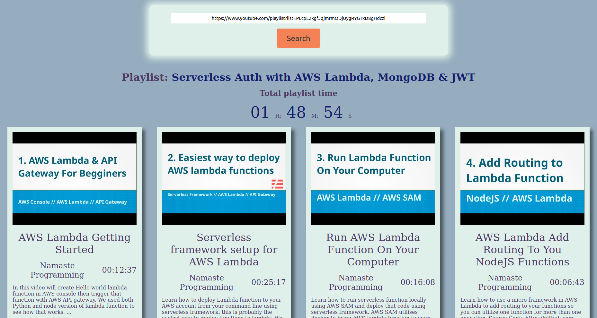

This is a simple app for computing total length of a youtube playlist. It uses simple express backend server, which calls Youtube API for getting info about playlist and its videos. Than it serves some static content for the frontend. It has simple HTML structure and CSS styling without any framework. Then it has some client side code, which calls server API. It then creates elements for displaying the retrieved information. The app is deployed on heroku. Youtube has some quotas (limits) for its API, so it's possible that the app might not work all the time.

