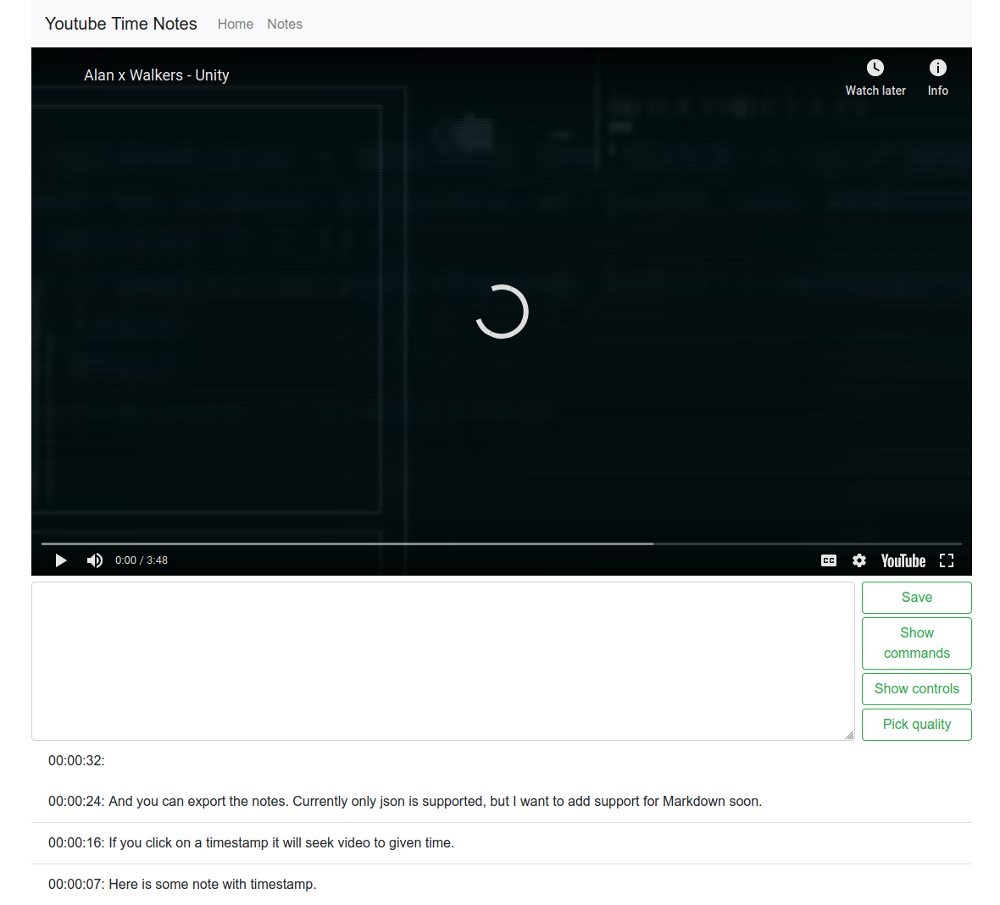

This is a notetaking app for youtube. Insert an youtube link and start typing whenever you want. While you are typing, the video is paused until you hit enter, which saves your note and continues to play. Clicking on the note will seek the player to time, when the note was created. Then you hit save and you can view all of your notes. You can also export them, currently only json is supported.

For playback I am using Youtube iFrame API. For styling bootstrap is used. Notes are stored in the localstorage of a browser.

