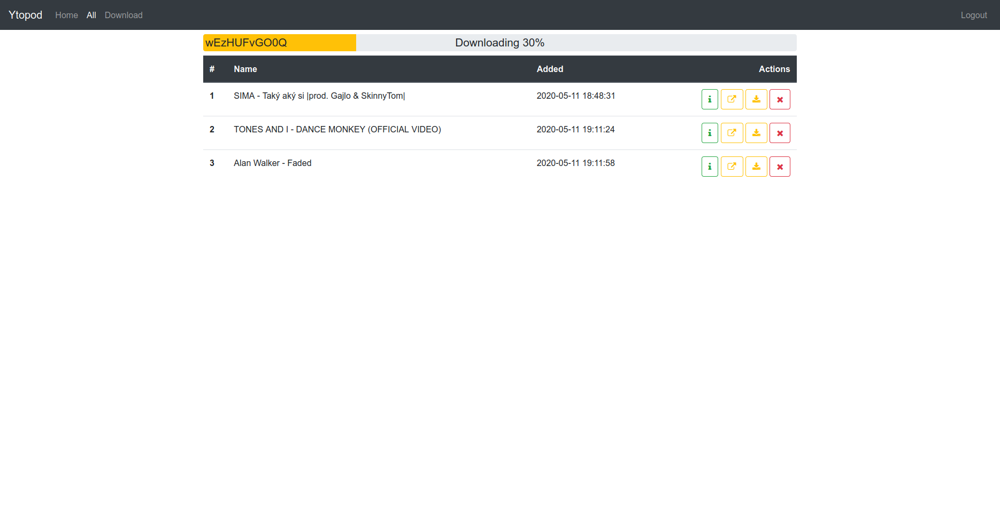

This app is used for creating RSS podcast feeds from youtube videos. It let's you download youtube video, which gets converted to audio and added to RSS feed. It requires a registered user, which will be created after initial start.

It was built using Flask Python webframework. Flask Login and Flask HTTP Auth is used for user management. SQLAlchemy is used for database management. Currently only SQLite database is supported. For real time video download presentation is used SocketIO library, working with python on server side and javascript on browser (client) side. For styling I used Bootstrap CSS and JS framework. For downloading video there is Youtube-dl python package, for converting videos to audio files is used ffmpeg linux package. The for RSS feed generation there is feedgen. Everything runs in docker containers managed by docker compose.

