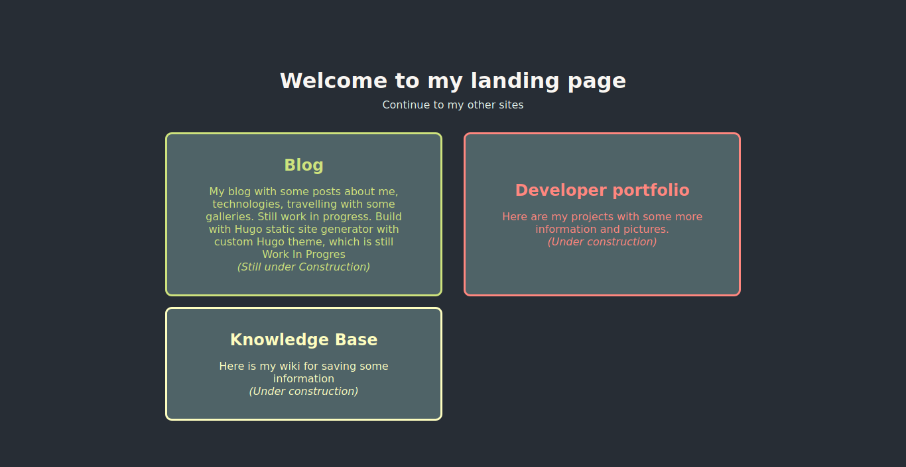

This is my landing page, from where I should be able to get to my other pages. For now there is my future blog and portfolio website, which are work in progres. I have also planned some wiki or knowledge base website, which is just a place holder for now.

This site is build using vanilla HTML and CSS.

